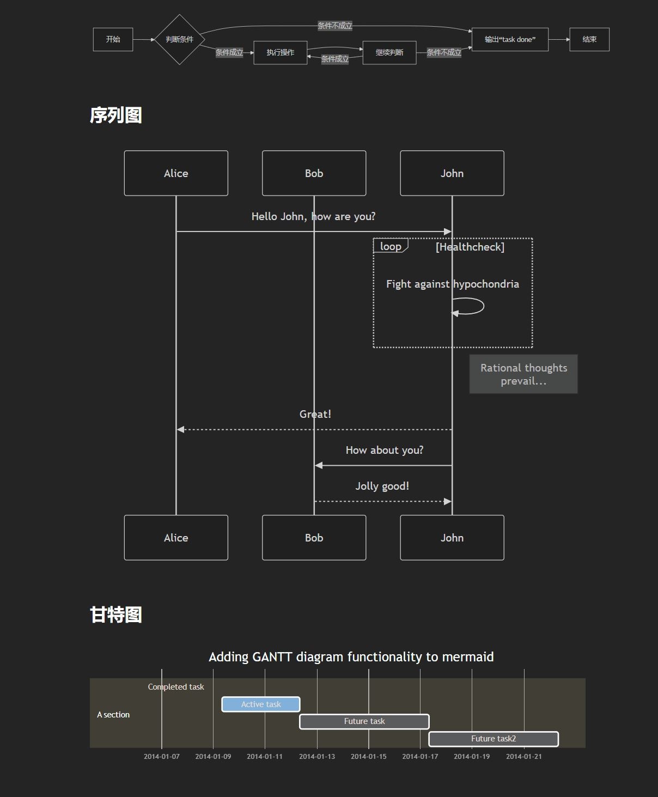
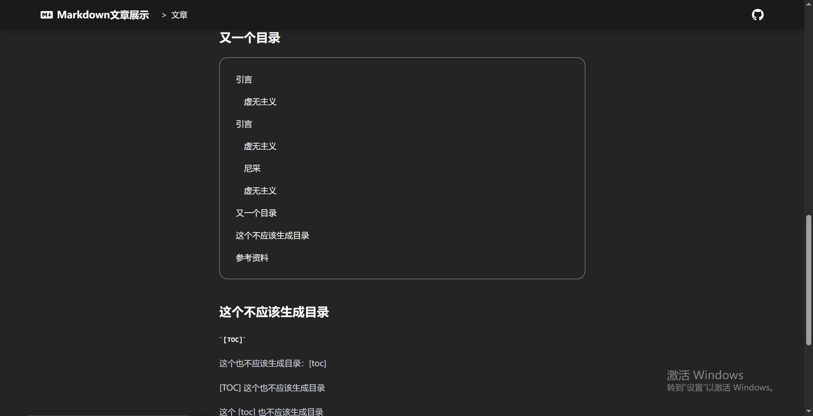
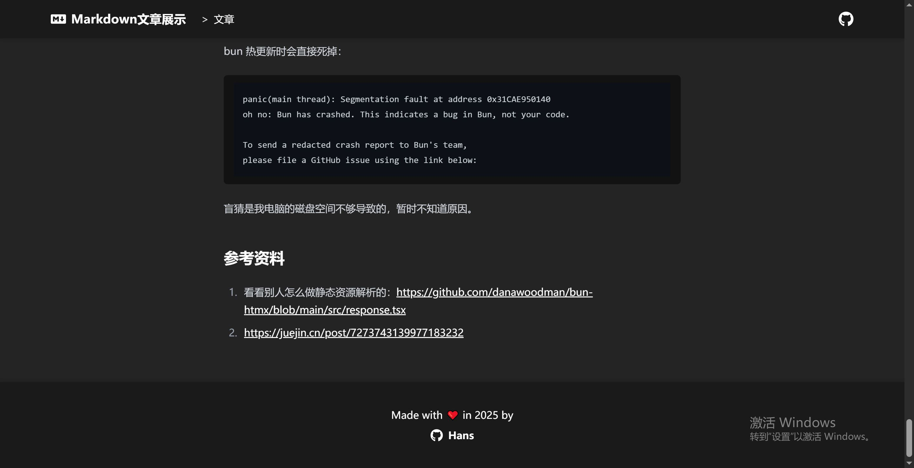

[TOC]

# bun 全栈开发尝鲜：用 bun-react-template 实现 Markdown 文章展示

## 引言

bun 是一个新兴的 JavaScript 运行时，旨在提供比 Node.js 更快的性能和更好的开发体验。本文是一个 bun 尝鲜项目，将介绍如何使用 bun-react-template 创建一个简单的全栈应用，实现 Markdown 文章展示功能。

根据官方文档安装，然后“编辑系统环境变量”找到“admin 的用户变量”的 Path 变量，把 bun 新增的路径改成`C:\bun\.bun\bin`（仅适用于我个人）。

[项目 GitHub 传送门](https://github.com/Hans774882968/bun-markdown-display)

本文 52pojie：https://www.52pojie.cn/thread-2034041-1-1.html

本文 CSDN：https://blog.csdn.net/hans774882968/article/details/148211959

本文 juejin：https://juejin.cn/post/7507888457705226303

**作者：[hans774882968](https://blog.csdn.net/hans774882968)以及[hans774882968](https://juejin.cn/user/1464964842528888)以及[hans774882968](https://www.52pojie.cn/home.php?mod=space&uid=1906177)**

## 初始化项目

[为 Cursor 指定项目规范](https://github.com/Hans774882968/bun-markdown-display/blob/main/.cursor/rules/specification.mdc)

命令：`bun init`。注意，和 Vite 不同，bun 不会问你项目名，而 package.json 的 name 默认为“bun-react-template”，所以需要提前建好文件夹。另外，bun 自动安装依赖的时候连个进度条都没有，就在那卡着，确实很不友好。

给 Cursor 的 Prompt：

> 请帮我实现 markdown 展示功能。
>
> 后端：
>
> 接口返回值规范：`Resp<T>: { code: number, msg: string, data: T }`。比如对于 404 的情况，不返回 HTTP 404，而是返回`{ code: 404, msg: 'not found', data: null }`。
>
> GET 接口/allArticles。无入参，返回 JSON：`Array<{ url: string, title: string }>`。
>
> GET 接口`/article/:aid`，获取单篇文章。aid 单调递增，初始值为 114514，每次增加 10 到 20。返回 JSON：`{ content: string, title: string }`。
>
> 为了实现方便，不使用 SQL，而是用 JSON 文件存储文章信息。该文件有 2 个字段，aid 和 title。获取单篇文章的接口读取该文件后，在项目根目录的/mds 文件夹下读取对应标题的 markdown 文件，作为返回值 JSON 的 content 字段。
>
> 前端：
>
> 首页：请求/allArticles，渲染出文章列表。每篇文章有一个 div，div 下有一个 a 标签。
>
> 具体文章：请求单篇文章的接口，接口返回 code: 404 则重定向到 404 页面，404 页面要告知用户，找不到的文章的 ID。否则渲染 markdown 文章为 HTML 并展示。markdown 文章的代码要用 highlight.js 实现高亮功能。
>
> 渲染 markdown 时注意防范 XSS。
>
> 修改 bun 项目配置，开发阶段前端运行在端口 5201，后端运行在端口 5202。如果 bun 项目的前后端默认跑在同一个端口，则都运行在 5201 端口。

默认端口为 3000，修改方式：

```ts
const server = serve({
  port: process.env.NODE_ENV === "production" ? 5202 : 5201,
});
```

Cursor 生成的代码基本可用，但需要修些小问题。

### 引入 highlight.js

AI 生成的引入 highlight.js 的代码不可用。查看文档，新版 marked 要这么引入：

```ts
// 配置 marked 使用 marked-highlight 和 highlight.js
marked.use(
  markedHighlight({
    emptyLangClass: "hljs",
    langPrefix: "hljs language-",
    highlight(code, lang, _info) {
      const language = hljs.getLanguage(lang) ? lang : "plaintext";
      return hljs.highlight(code, { language }).value;
    },
  })
);
```

### highlight.js 生成的元素没有类名

`sanitize-html` 默认会过滤掉 `span` 的 `class` 属性，导致`highlight.js`生成的样式类名丢失。

```typescript
const sanitizedHtml = sanitizeHtml(marked(article.content), {
  allowedTags: sanitizeHtml.defaults.allowedTags.concat(["img"]),
  allowedAttributes: {
    ...sanitizeHtml.defaults.allowedAttributes,
    code: ["class"],
    pre: ["class"],
    // 关键修复：允许 span 的 class 属性（hljs 生成的元素）
    span: ["class"],
  },
});
```

### 没看到 prose 类相关的样式

Tailwind CSS 4 不再需要`tailwind.config.js`，可直接在 CSS 文件加一行`@plugin`。`src\index.css`新增：

```css
@plugin "@tailwindcss/typography";
```

## marked 支持 mermaid

效果：



询问 deepseek 或者看[参考链接 2](https://juejin.cn/post/7273743139977183232)知道，需要先引入 mermaid：`bun add mermaid`。接着自定义一个 marked renderer 把 mermaid 代码包起来：

```typescript
// Custom renderer for mermaid code blocks
const renderer: RendererObject = {
  code({ lang, text }) {
    if (lang === "mermaid") {
      return `<div class="mermaid">${text}</div>`;
    }
    return false; // use default rendering
  },
};
```

然后调用 mermaid 包渲染出 svg：

```ts
// Initialize mermaid
useEffect(() => {
  mermaid.initialize({
    startOnLoad: false,
    theme: "dark",
    securityLevel: "strict",
  });
}, []);

// TODO: 错误处理
// Render mermaid diagrams after content loads
useEffect(() => {
  if (!articleRef.current || !htmlContent) {
    return;
  }
  const mermaidElements =
    articleRef.current.querySelectorAll<HTMLElement>(".mermaid");
  if (mermaidElements.length > 0) {
    try {
      mermaid.run({
        nodes: mermaidElements,
      });
    } catch (error) {
      console.error("Mermaid rendering error:", error);
    }
  }
}, [htmlContent]);
```

## 支持输入`[TOC]`生成目录，类似于 Typora

效果：



TOC 是 Table of Contents 的缩写，表示文章的目录。问了 deepseek（Prompt：“有同时支持 TOC 的生成和标题 ID 生成的 marked 的 renderer 的 npm 包推荐吗”），也查了搜索引擎，没找到提供这个功能的包。还是决定自己写代码。[src/common/markedInit.ts](https://github.com/Hans774882968/bun-markdown-display/blob/main/src/common/markedInit.ts)：

```ts
import { marked, RendererObject, Tokens } from "marked";

const usedIds = new Set<string>();
function generateUniqueId(text: string) {
  let counter = 1;
  let id = `${text}-${counter}`;
  while (usedIds.has(id)) {
    counter++;
    id = `${text}-${counter}`;
  }
  usedIds.add(id);
  return id;
}

// Custom renderer for mermaid code blocks
const wrapMermaidDivRenderer: RendererObject = {
  code({ lang, text }) {
    if (lang === "mermaid") {
      return `<div class="mermaid">${text}</div>`;
    }
    return false; // use default rendering
  },
};

const addIdToHeadingRenderer: RendererObject = {
  heading({ text, depth }) {
    const id = generateUniqueId(text);
    return `<h${depth} id="${id}">${text}</h${depth}>\n`;
  },
};

marked.use({ renderer: wrapMermaidDivRenderer });
marked.use({ renderer: addIdToHeadingRenderer });

// 提取标题结构
export const extractHeadings = (markdown: string) => {
  const tokens = marked.lexer(markdown);
  return tokens.filter(
    (token) => token.type === "heading"
  ) as Array<Tokens.Heading>;
};

// 生成目录HTML
export const generateTOC = (headings: Array<Tokens.Heading>) => {
  if (headings.length === 0) return "";

  let tocHtml = '<div class="article-toc">\n<ul>\n';

  headings.forEach((heading) => {
    const { text, depth } = heading;
    const id = generateUniqueId(text);

    tocHtml += `<li class="toc-item toc-level-${depth}">`;
    tocHtml += `<a href="#${id}">${text}</a>`;
    tocHtml += "</li>\n";
  });

  tocHtml += "</ul>\n</div>";
  return tocHtml;
};

// 处理 [TOC] 标记入口
export const processTOC = (markdown: string) => {
  usedIds.clear();
  const headings = extractHeadings(markdown);
  const tocHtml = generateTOC(headings);
  usedIds.clear();
  return markdown
    .split("\n")
    .map((ln) => {
      return ln.trim() === "[TOC]" || ln.trim() === "[toc]" ? tocHtml : ln;
    })
    .join("\n");
};
```

组件在`useEffect`中，在调用`const result = marked(article.content)`，先调用`processTOC`函数。代码会先执行`processTOC`，再执行`wrapMermaidDivRenderer, addIdToHeadingRenderer`。两者都会用到全局变量`usedIds`，所以在组件挂载时，要保证`usedIds`是空的。在生成完`TOC`后，`addIdToHeadingRenderer`还会用到这个变量，所以还需要再清空一次`usedIds`。

`sanitizeHtml`记得传入：

```typescript
'li': ['class'], // For TOC
'h1': ['id'],
'h2': ['id'],
'h3': ['id'],
'h4': ['id'],
'h5': ['id'],
'h6': ['id'],
```

## 接入 eslint

找了个 Vite + React 的项目模板的 eslint 配置文件。

```powershell
bun add -D eslint globals
@eslint/js typescript-eslint eslint-plugin-react-hooks eslint-plugin-react-refresh
```

然后配置：`"lint": "eslint ."`。使用：`bun lint --fix`。

## 打包流程（并没有考虑部署上线）

我确实不喜欢 bun 项目模板的项目结构，所以调整成了这样：

```yaml
src:
  frontend:
    components:
      Article.tsx
      ArticleList.tsx
      NotFound.tsx
    App.tsx
    index.css
    spa.tsx
  backend:
    beIndex.ts
```

说实话，bun 打包的问题确实困扰了我许久。bun 项目在 GitHub 有那么多 star，但是 bun 给的模板项目也好，官方文档也好，互联网上也好，这方面的资料都特别少。但通过查官方文档、问 AI 等手段，我感觉，bun 的前后端应该是需要不同命令打包的。打包前端，只需要用 bun 模板项目的`build.ts`脚本即可：`bun run build`或`bun run build.ts`（前者会自动找到后者）。但打包后端以后，总是跑不起来。我排查许久，才发现，原因是，打包过程会将

```js
import index from "./index.html";
```

转为

```js
var src_default = "./index-12n45nbf.html";
```

但这方面资料太少，我确实不知道怎么阻止这个动作的发生。接下来，我又尝试了`bun build`命令（注：和`bun run build.ts`是两个东西，这个只能用来打包前端）的`--external`参数，发现：如果指定`index.html`的路径为`../index.html`，那么指定这个参数无效；但如果指定路径为`@/index.html`，那么这个参数就能把 import 语句变成`import M from"@/index.html";`。from 后面没有空格是因为我给`bun build`指定了`--production`参数。

于是我决定，指定路径为`@/index.html`，将`beIndex.ts`打包进`dist/backend`，这样无论是在 src 下还是 dist 下，`beIndex.ts`都可以通过统一的`../index.html`找到 HTML 文件。然后让 deepseek 写一个脚本进行字符串替换：

```ts
// fix-html-import.ts
import { readFileSync, writeFileSync } from "fs";
import { join } from "path";

const PROJECT_NAME = "bun-markdown-display";

// Usage: 项目根目录 bun build:be2
function main() {
  const distFile = join(__dirname, "..", "dist", "backend", "beIndex.js");
  const code = readFileSync(distFile, "utf-8");

  // import <任意标识符> from ["']@/index.html["']
  const importRegex = /import\s+(\w+)\s+from\s*["']@\/index\.html["']/g;

  // 检查是否匹配成功
  if (!importRegex.test(code)) {
    console.log(
      `[${PROJECT_NAME}] No matching HTML import found. Skipping fix.`
    );
    process.exit(0);
  }

  importRegex.lastIndex = 0;

  const fixedCode = code.replace(importRegex, (match, identifier) => {
    console.log(`[${PROJECT_NAME}] Restoring import: ${match}`);
    return `import ${identifier} from "../index.html"`;
  });

  writeFileSync(distFile, fixedCode);
  console.log(`[${PROJECT_NAME}] HTML imports restored successfully!`);
}

main();
```

最后整合一下整个过程，沉淀到`package.json`的 scripts 里：

```json
{
  "scripts": {
    "dev": "bun --hot src/backend/beIndex.tsx",
    "start": "NODE_ENV=production bun src/backend/beIndex.tsx",
    "build:all": "bun build:fe && bun build:be",
    "build:fe": "bun run build.ts",
    "build:be": "bun build:be1 && bun build:be2",
    "build:be1": "bun build src/backend/beIndex.tsx --outdir dist/backend --target bun --external '@/index.html' --production",
    "build:be2": "bun run scripts/fixHtmlImport.ts",
    "run:dist": "bun run dist/backend/beIndex.js"
  }
}
```

执行`bun build:all`即可完成打包。执行`bun run:dist`即可启动后端项目。前端项目和后端接口跑在同一个端口 5202 下。

## 为所有页面添加统一的导航栏和页脚

给 Cursor 的 Prompt：

> 请为每个页面添加统一的导航栏和页脚，组件命名为 Layout.tsx。
>
> 导航栏：要求页面滚动时一直贴着视窗顶部，但在顶部时不要遮挡页面其他部分的内容。导航栏内的左侧有一个“Markdown 文章展示”加粗，是指向首页的链接。右侧有一个 GitHub 图标，也是链接，地址为 https://github.com/Hans774882968/bun-markdown-display
>
> 页脚：Copyright.tsx。分两行，第一行是 Made with ❤ in {currentYear} by，第二行是一个链接，文本为 Hans，链接为 https://github.com/Hans774882968

出来效果很不错。看了下代码，生成了一个带`children`入参的`Layout.tsx`，图标库选用了`react-icons`：

```typescript
import { FaGithub } from "react-icons/fa";
import { SiMarkdown } from "react-icons/si";
```

微调一下：

> 1. nav-brand 离左侧 80px、GitHub 图标离右侧 80px。
> 2. 页脚的“Hans”左侧加一个 GitHub 图标，并加粗。
> 3. 导航栏和页脚的背景颜色应和 main-content 的黑色接近但又略有差别，并添加阴影，使得两者和 main-content 之间有视觉上的差别。记得对应修改文字颜色为某种白色。
> 4. 导航栏的“Markdown 文章展示”左边加一个 Markdown 的图标。导航栏左侧添加面包屑。首页保持原样，文字页面的显示类似于“Markdown 文章展示 > 文章”。

效果：



## 阉割版的登录系统

我的 Cursor 账号没法发请求了，只能暂时由 deepseek 代劳。我把给 cursor 的项目规范一并粘给了 deepseek，但可惜生成的代码质量仍然不尽如人意。Prompt：

> 代码规范：
>
> - 不要出现`for() {if() {}}`，if 后没有代码的情况。总是考虑 early return/continue/break 的写法，减少代码嵌套层级。
> - Don't Repeat Yourself. 若发现一段代码重复出现 3 次及以上，应抽象出函数。
>
> 项目规范：
>
> 该项目实现 markdown 文章的渲染、添加、修改等功能。技术栈为 Bun+React19+Tailwind CSS4+marked+react-icons。生成代码时优先考虑使用这些技术。
>
> 前端规范
>
> - 生成样式时使用 Tailwind CSS
> - 文件命名使用小驼峰命名法
> - 用 Bun 作为包管理器
>
> React 规范
>
> - 遵循 React 最佳实践
> - 使用 React Hooks
>
> 后端规范
>
> - api 的请求参数和返回值类型都放在 src/types 下，让前端代码也能引用。
>
> 请实现小型登录系统。
>
> 后端：
>
> 用户信息存在.env 文件，是 JSON 列表，列表元素有 uname 和 pwd 两个字段，pwd 采用 PBKDF2 加密。
> 登录接口传来 uname 和 pwd 字段，执行 PBKDF2(salt1+pwd+salt2)后和.env 存储的 pwd 字段比较，一致则登录成功。
>
> 关于加密算法：使用 PBKDF2，salt1 和 salt2 都从.env 拿。额外使用 salt2 作为 PBKDF2 的盐。比较密码加密后的值是否匹配时，采用 timingSafeEqual。
>
> 登录接口的错误处理：若.env 不存在用户信息或未匹配到相同 uname，接口仅返回“用户{uname}不存在”，但控制台输出相应的具体错误信息。若用户信息不存在 uname 或 pwd，返回“登录接口出错”，但控制台输出“用户表格式错误”。若 salt1 或 salt2 未成功读取，返回“登录接口出错”但控制台输出对应的错误信息。
>
> 为了方便，编写 addUser.ts 脚本，向.env 文件添加用户信息，这个脚本用 bun 运行，会引用上述的密码字符串加密算法。项目不提供注册功能，唯一的注册方式是在服务器执行上述写入.env 文件的 ts 脚本。
>
> 脚本的用户名和密码仅支持从命令行输入。脚本的所有输出都有前缀“[bun-markdown-display]”。
>
> 脚本的错误处理：若.env 不存在用户信息，报错并结束。若用户信息不存在 uname 或 pwd，报错并结束。若输入的 uname 已经存在，报错并结束。若 salt1 不存在，报错说“salt1”不存在并结束，salt2 同理。写入.env 失败则报错并结束。
>
> 用 jwt 做登录状态保持。前端将其存在 LocalStorage。jwt token 有效期 7 天，但要实现一个 logout 接口，因此需要实现一个基于内存的令牌黑名单机制。为了实现方便，不使用 Redis。
>
> 后端技术选型：Bun 内置 API。
>
> 前端：
>
> 若未登录，导航栏右侧、GitHub 图标左边，添加一个“登录”按钮，点击后跳转到登录页面。若已登录，同样位置显示加粗的用户名，以及“登出”按钮，点击后调用 logout 接口，成功后刷新页面，失败则 toast 报错，不刷新页面。
>
> 登录页面的 URL 可输入一个参数，表示登录后要重定向到哪个 URL。
>
> 登录表单有用户名、密码两个字段，都是必填，长度均不能超过 30 字符，后端也要加这个参数校验。密码输入框内部右侧展示一个眼睛，点击可显示明文或星号。点击提交按钮，向后端接口发出请求。登录失败展示 toast，登录成功则重定向到目标页面的 URL。
>
> 点击提交按钮或点击“登出”按钮，等待接口返回期间，按钮不能点击。
>
> 前端技术选型：
>
> - 表单管理: React Hook Form
> - UI 组件: @headlessui/react
> - Toast 通知: Sonner
> - 图标: react-icons
>
> 请注意，这是一个开源项目，所有代码都是公开的。生成完代码后，请评估该方案的安全风险。

## 体验感受

bun 热更新时会直接死掉：

```
panic(main thread): Segmentation fault at address 0x31CAE950140
oh no: Bun has crashed. This indicates a bug in Bun, not your code.

To send a redacted crash report to Bun's team,
please file a GitHub issue using the link below:
```

盲猜是我电脑的磁盘空间不够导致的，暂时不知道原因。

## 参考资料

1. 看看别人怎么做静态资源解析的：https://github.com/danawoodman/bun-htmx/blob/main/src/response.tsx
2. https://juejin.cn/post/7273743139977183232
