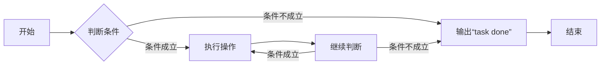
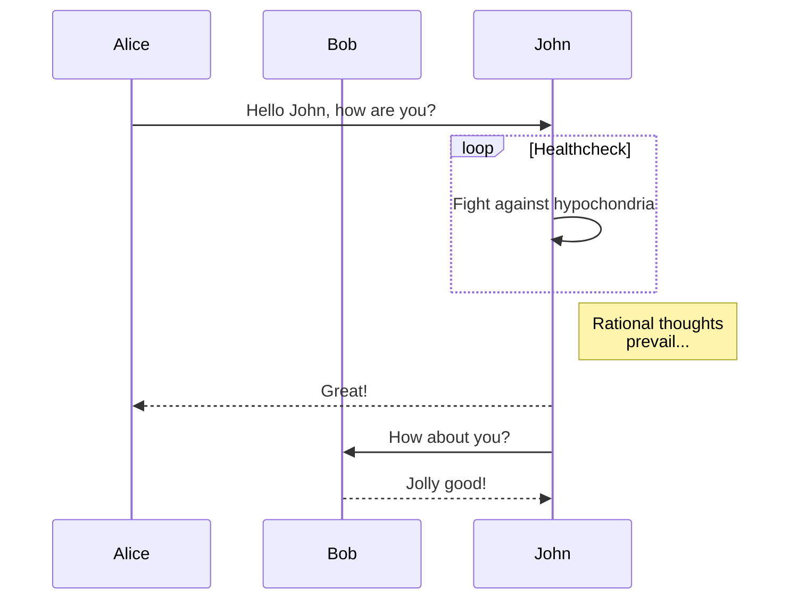
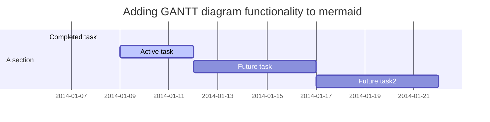

[TOC]

## 代码块

各种语言的 Hello World 程序：[https://thehelloworldcollection.com/（已无法访问）](https://thehelloworldcollection.com/)

```python
print("Hello World")
```

```javascript
console.log("Hello World");
```

```java
public class HelloWorld {
  public static void main(String[] args) {
    System.out.println("Hello World");
  }
}
```

```c
#include <stdio.h>

int main() {
  printf("Hello World");
  return 0;
}
```

## 表格

表格 1

| 姓名 | 年龄 | 性别 |
| ---- | ---- | ---- |
| 张三 | 20   | 男   |
| 李四 | 22   | 女   |
| 王五 | 25   | 男   |

表格 2

| 姓名 | 年龄 | 性别 | 地址 |
| ---- | ---- | ---- | ---- |
| 张三 | 20   | 男   | 北京 |
| 李四 | 22   | 女   | 上海 |
| 王五 | 25   | 男   | 广州 |

## 图片


## 链接

[Markdown](https://www.markdownguide.org/basic-syntax/)是一种轻量级标记语言，它允许人们使用易读易写的纯文本格式编写文档，然后转换成结构化的 HTML 页面。

## 引用

> 这是一个引用。

## 列表

- 项目 1
- 项目 2
- 项目 3

1. 项目 1
2. 项目 2
3. 项目 3

## 分割线

---

## 脚注

这是一个脚注[^1]。

[^1]: 这是一个脚注。

## 数学公式

这是一个数学公式：$E=mc^2$。

## 流程图

```
dist\chunk-pcaanx3p.js:542 Uncaught TypeError: l.transition is not a function
    at SVGGElement.<anonymous> (dist\chunk-pcaanx3p.js:542:3571)
    at SVGGElement.<anonymous> (dist\chunk-pcaanx3p.js:491:32940)
(anonymous)	@	dist\chunk-pcaanx3p.js:542
(anonymous)	@	dist\chunk-pcaanx3p.js:491
```

TODO: 开发环境没有上述错误。但生产环境，鼠标滑过流程图有上述错误，而滑过序列图和甘特图都没有上述错误。



## 序列图



## 甘特图


