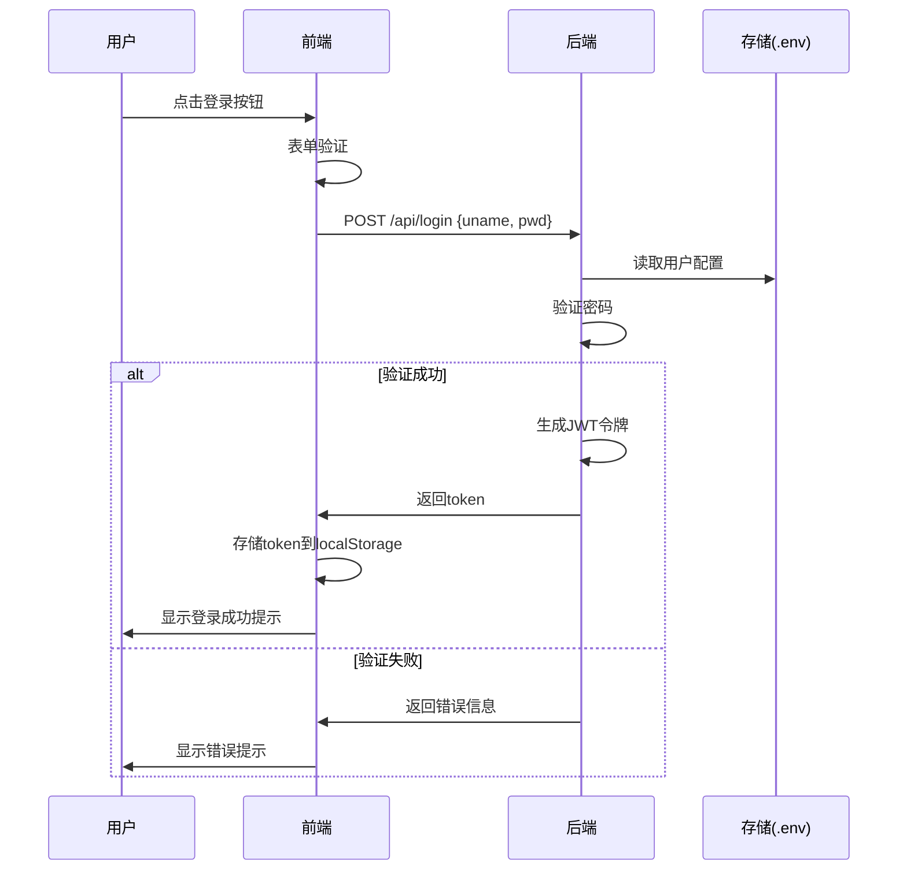
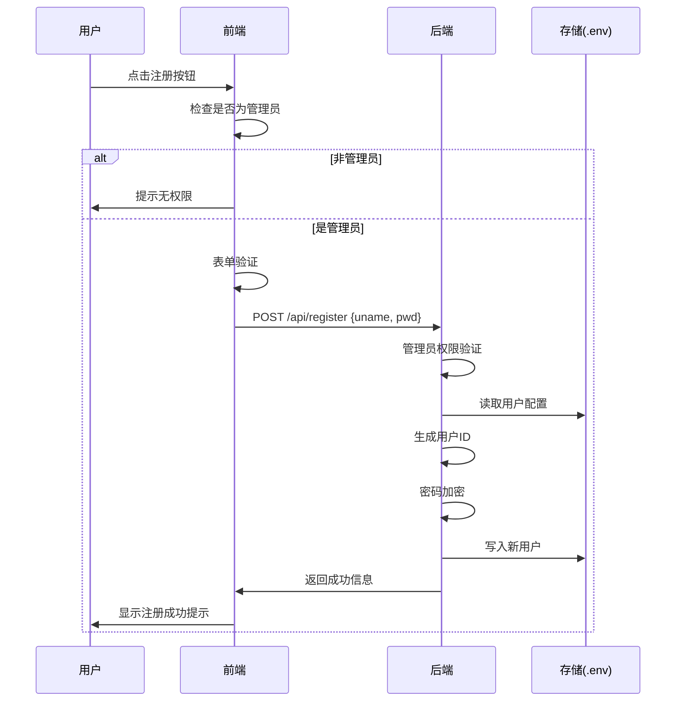

[toc]

# 登录注册系统现状分析与用户管理页面方案

## Prompt

1

> 请阅读项目代码并输出一篇文档。第一部分是登录、注册系统现状分析。第一章节分别绘制登录和注册过程的时序图。然后说明项目是如何实现登录系统的前端和后端部分的，各占一个章节。第二部分是实现用户管理列表页的技术方案文档。需要给出可以选哪些组件库实现列表页。use context7

2

> 大佬，请根据该文档 `@[AI] 登录注册系统现状分析与用户管理页面方案.md` 实现用户管理页面。开始干活吧！use context7

## 第一部分：登录注册系统现状分析

### 1. 登录和注册流程

#### 1.1 登录流程时序图



#### 1.2 注册流程时序图



### 2. 前端实现分析

前端使用 React 实现登录注册功能，主要包含以下组件：

1. `LoginForm.tsx`

- 使用 react-hook-form 进行表单管理
- 实现用户名、密码输入框
- 密码框支持显示/隐藏
- 表单验证
- 登录成功后存储 token 并跳转

2. `RegisterForm.tsx`

- 继承 LoginForm 的基础功能
- 增加确认密码输入
- 密码强度检测
- 管理员权限检查

3. `UserStatus.tsx`

- 显示当前用户状态
- 管理员显示注册入口
- 实现退出登录功能

4. `useJwtTokenStore.ts`

- 使用 zustand 管理登录状态
- 解析 JWT 获取用户信息
- 持久化存储到 localStorage

### 3. 后端实现分析

后端使用 Bun 实现，主要包含以下模块：

1. 认证服务 (`auth.ts`)

- JWT 验证中间件
- 管理员权限检查
- 登录状态验证

2. 用户管理

- 密码加密存储
- 用户信息管理
- 权限控制

3. API 实现

- `/api/login`: 处理登录请求
- `/api/register`: 处理注册请求
- `/api/user/isAdmin`: 检查管理员权限

## 第二部分：用户管理列表页技术方案

### 1. 可选组件库分析

#### 1.1 shadcn/ui

优点：

- 完全可定制的组件
- 使用 Tailwind CSS
- 支持服务端渲染
- 提供完整的表格组件
- 开源免费

组件示例：

```tsx
<Table>
  <TableHeader>
    <TableRow>
      <TableHead>用户名</TableHead>
      <TableHead>角色</TableHead>
      <TableHead>操作</TableHead>
    </TableRow>
  </TableHeader>
  <TableBody>
    {users.map((user) => (
      <TableRow key={user.uid}>
        <TableCell>{user.uname}</TableCell>
        <TableCell>{user.isAdmin ? "管理员" : "普通用户"}</TableCell>
        <TableCell>
          <Button variant="ghost">编辑</Button>
          <Button variant="destructive">删除</Button>
        </TableCell>
      </TableRow>
    ))}
  </TableBody>
</Table>
```

#### 1.2 @tanstack/react-table

优点：

- 强大的表格功能
- Headless UI 设计
- 支持排序、过滤、分页
- 类型安全
- 高性能

组件示例：

```tsx
const columns = [
  {
    accessorKey: "uname",
    header: "用户名",
  },
  {
    accessorKey: "isAdmin",
    header: "角色",
    cell: (info) => (info.getValue() ? "管理员" : "普通用户"),
  },
];

const table = useReactTable({
  data,
  columns,
  getCoreRowModel: getCoreRowModel(),
  getSortedRowModel: getSortedRowModel(),
  getPaginationRowModel: getPaginationRowModel(),
});
```

### 2. 最终选用的组件库

采用 shadcn/ui + @tanstack/react-table 的组合：

1. 使用 shadcn/ui 的样式系统和基础组件
2. 使用 @tanstack/react-table 实现表格功能
3. 两者结合可以实现美观且功能强大的用户管理界面
4. 应先封装出 HansProTable 组件，再在用户管理页面使用

HansProTable 组件：

- 数据为空字符串时，显示“-”

### 3. 功能规划

1. 基础功能

- 用户列表展示
- 分页
- 排序
- 搜索过滤

2. 用户操作

- 创建用户
- 编辑用户信息
- 删除用户
- 修改密码
- 设置管理员权限

3. 批量操作

- 批量删除
- 批量权限修改

4. 其他功能

- 表格列自定义
- 导出数据
- 操作日志

### 4. 界面设计

1. 布局

- 顶部：搜索栏和操作按钮
- 中间：用户列表表格
- 底部：分页控制

2. 交互设计

- 行内编辑
- 右侧抽屉式表单
- 批量操作工具栏
- 状态即时更新

3. 响应式设计

- 移动端适配
- 表格横向滚动
- 操作按钮自适应

### 5. 后端改造

新增 API `/api/user/all`。GET 请求。

- 权限控制：只有管理员能访问。注意，前端也需要做权限控制，不是管理员时要重定向回首页，与`src\frontend\components\RegisterForm.tsx`一致。
- 用户新增字段`string personalizedSign`，个性签名。
- 关注安全性，不要暴露敏感信息。比如，接口不应返回`pwd`。
