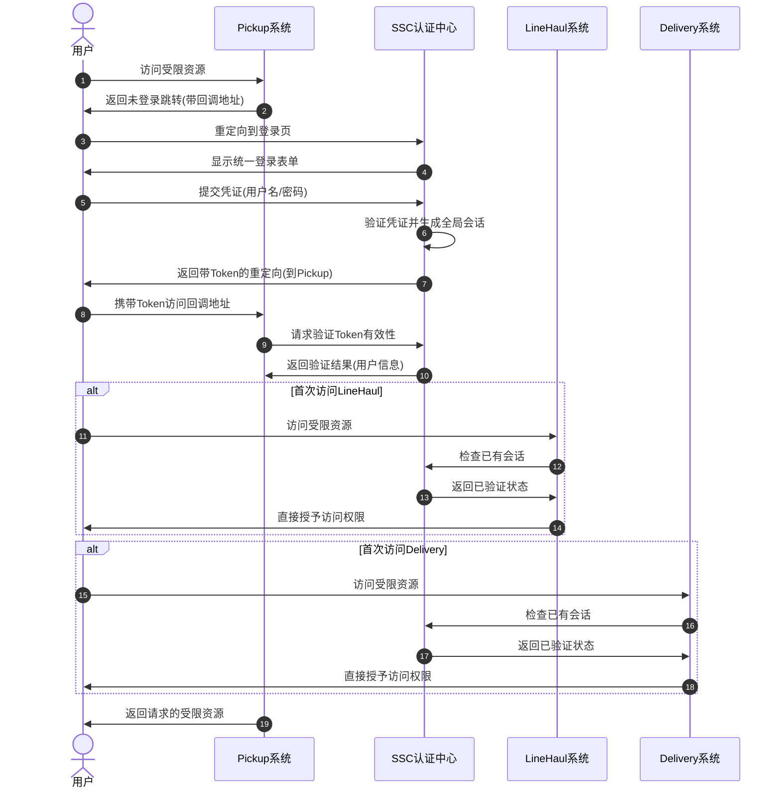
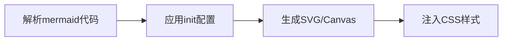
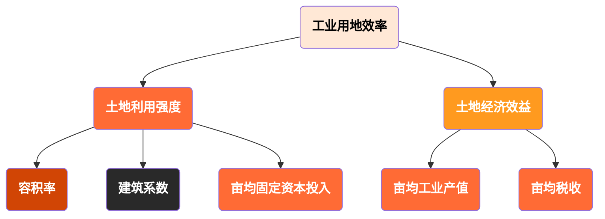
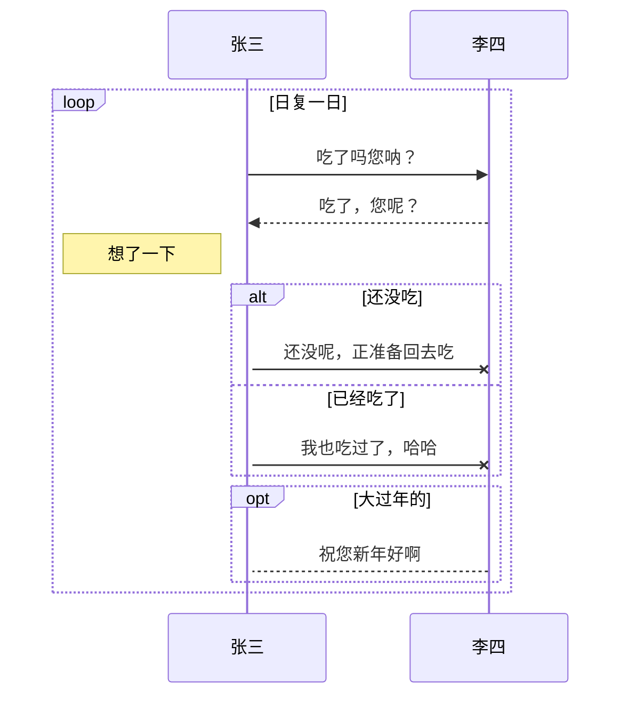
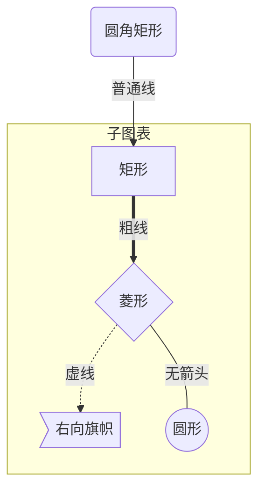
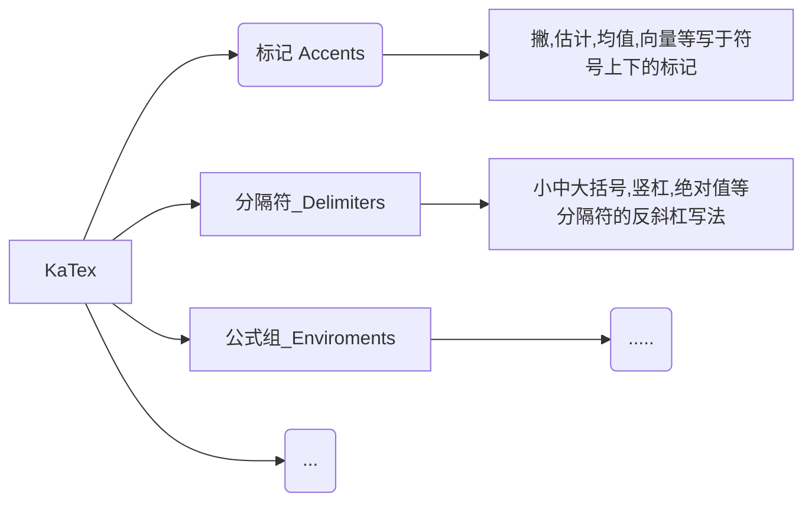

Prompt：

> 你是一名专家后端工程师，你打算在一个名为 SSC 的多系统应用群中实现单点登录。该应用群的系统主要有 Pickup、LineHaul、Delivery。请编写能够渲染出时序图的 mermaid 代码

```mermaid
%%{init: {
    'theme': 'base',
    'themeVariables': {
        'background': '#FFE8D6',
        'primaryColor': '#FF6B35',
        'primaryBorderColor': '#FF6B35',
        'lineColor': '#FF9A1F',
        'actorBkg': '#FF9A1F',
        'actorBorder': '#D14505',
        'noteBkgColor': '#292929',
        'noteTextColor': '#FFE8D6',
        'signalColor': '#292929',
        'signalTextColor': '#FFE8D6'
    },
    'themeCSS': '
        .actor > text { fill: #292929 !important; font-weight: bold; }
        .messageText { fill: #292929 !important; }
        #arrowhead path { fill: #D14505 !important; stroke: #D14505 !important; }
        .sequenceNumber { fill: white !important; }
    '
}}%%
sequenceDiagram
  autonumber
  actor User as 用户
  participant P as Pickup系统
  participant SSO as SSC认证中心
  participant L as LineHaul系统
  participant D as Delivery系统

  User->>P: 访问受限资源
  P->>User: 返回未登录跳转(带回调地址)

  User->>SSO: 重定向到登录页
  SSO->>User: 显示统一登录表单

  User->>SSO: 提交凭证(用户名/密码)
  SSO->>SSO: 验证凭证并生成全局会话
  SSO->>User: 返回带Token的重定向(到Pickup)

  User->>P: 携带Token访问回调地址
  P->>SSO: 请求验证Token有效性
  SSO->>P: 返回验证结果(用户信息)

  alt 首次访问LineHaul
    User->>L: 访问受限资源
    L->>SSO: 检查已有会话
    SSO->>L: 返回已验证状态
    L->>User: 直接授予访问权限
  end

  alt 首次访问Delivery
    User->>D: 访问受限资源
    D->>SSO: 检查已有会话
    SSO->>D: 返回已验证状态
    D->>User: 直接授予访问权限
  end

  P->>User: 返回请求的受限资源
```

动态渲染流程：

```mermaid
graph LR
A[解析mermaid代码] --> B[应用init配置] --> C[生成SVG/Canvas] --> D[注入CSS样式]
```

类似于思维导图：

- `#FF6B35`类似 SSC Orange

```mermaid
graph TD
A(工业用地效率)-->B1(土地利用强度)
A-->B2(土地经济效益)
B1-->C1(容积率)
B1-->C2(建筑系数)
B1-->C3(亩均固定资本投入)
B2-->D1(亩均工业产值)
B2-->D2(亩均税收)

style A fill:#FFE8D6,font-weight:bold,color:black
style B1 fill:#FF6B35,font-weight:bold,color:white
style B2 fill:#FF9A1F,font-weight:bold,color:white
style C1 fill:#D14505,font-weight:bold,color:white
style C2 fill:#292929,font-weight:bold,color:white
style C3 fill:#FF6B35,font-weight:bold,color:white
style D1 fill:#FF6B35,font-weight:bold,color:white
style D2 fill:#FF6B35,font-weight:bold,color:white
```

循环：

```mermaid
sequenceDiagram
  participant z as 张三
  participant l as 李四
  loop 日复一日
    z->>l: 吃了吗您呐？
    l-->>z: 吃了，您呢？
    activate z
    Note left of z: 想了一下
    alt 还没吃
      z-xl: 还没呢，正准备回去吃
    else 已经吃了
      z-xl: 我也吃过了，哈哈
    end
    opt 大过年的
      l-->z: 祝您新年好啊
    end
  end
```

形状：

```mermaid
graph TB
  id1(圆角矩形)--普通线-->id2[矩形]
  subgraph 子图表
    id2==粗线==>id3{菱形}
    id3-.虚线.->id4>右向旗帜]
    id3--无箭头---id5((圆形))
  end
```

类似于思维导图：

```mermaid
graph LR
KaTex--> A(标记 Accents)
A-->撇,估计,均值,向量等写于符号上下的标记
KaTex--> 分隔符_Delimiters
分隔符_Delimiters-->小中大括号,竖杠,绝对值等分隔符的反斜杠写法
KaTex--> 公式组_Enviroments
公式组_Enviroments-->B(.....)
KaTex-->C(...)
```
